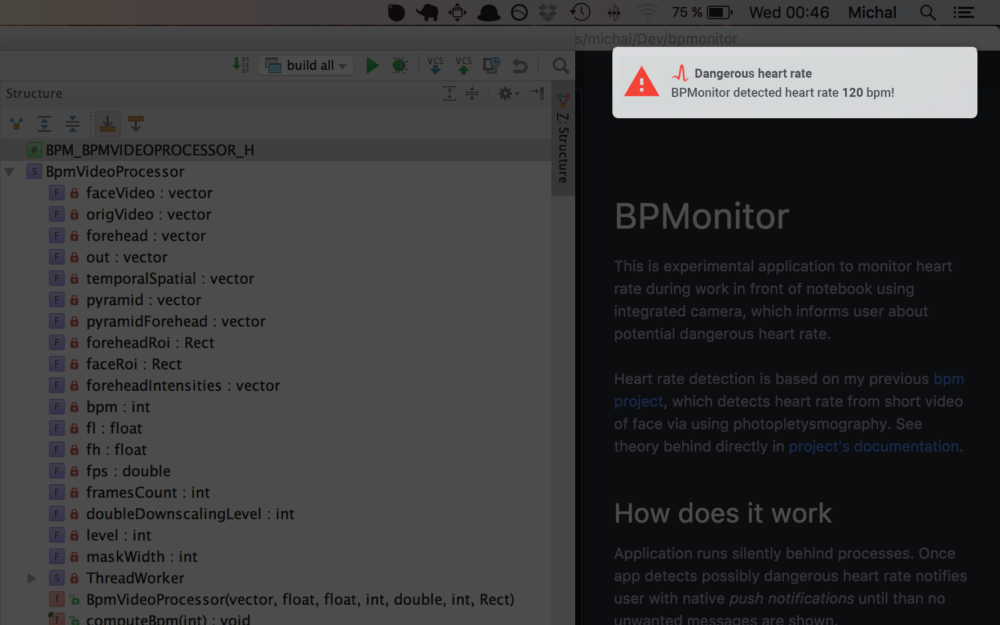

# BPMonitor vision

This is experimental application to monitor heart rate during work in front of notebook using integrated camera, which informs user about potential dangerous heart rate.

Heart rate detection is based on my previous [bpm project](http://github.com/michalsindelar/bpm), which detects heart rate from short video of face via using photopletysmography. See theory behind directly in [project's documentation](http://github.com/michalsindelar/bpm).

## How does it work
Application runs silently behind processes. Once app detects possibly dangerous heart rate notifies user with native _push notifications_ until than no unwanted messages are shown.

Detecting is triggered each 20 minutes. Integrated camera is used for grabbing enough frames for detection (about 15 seconds). Detection requires stable record (and face between camera of course), but user shouldn't notice any additional requirements. Application recognize unsuccessful attempt to detect heart rate and shorten period to next detection attempt and triggers pipeline again.

### Dangerous heart rate
Unusual high heart rate is called tachycardia and can be related to some diseases especially connected to nervous situation. Also people nervous system problems that are told to keep calm during workdays can monitor theirs heart rate in noninvasive way without even noticing (until potential problem).

### Notification
Standard minimal cutoff heart rate - above considered as tachycardia - is 100 bpm. After detecting higher bpm application runs second attempt immediately again to double ensure correct result. In case of second dangerous detection pushes native _push notification_ to inform user, result is ignored in the other way.    
### Other feature
Application stores detections result in own database and enables user to export data. E.g. useful for daily overview - this use is similar like official medical monitoring with holter's monitor.

### Samples

